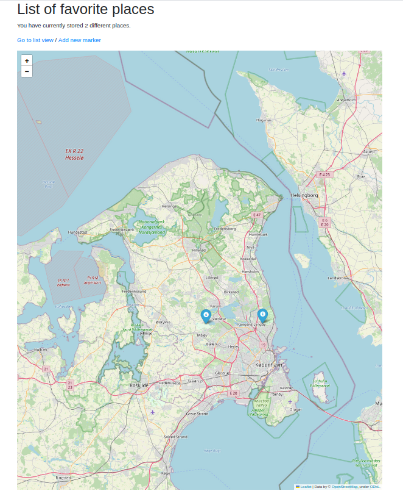
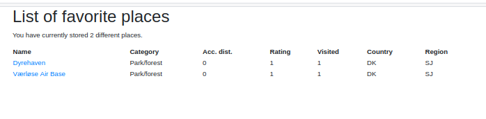

# A simple map app for favorite places

This app is a simple way to mark your favorite places and display them on a map along with a description. 

The app is made with Flask, folium, and a SQL database. The app is more or at less at the MVP stage, but I'm still in the process of developing some of the core functionalitites.

Here are some screenshots to give you an idea what the app is for:

The main page:

The listing page:

Example of a page of a single favorite place (called "marker" in the app):

## How to use

The app consists of two Docker containers, one for the database (Postgres) and one for the app, with a Gunicorn server. There's no HTTPS and no passwords, so don't store any sensitive information!

There are two ways of running the app:

The simplest way to run the app is to create a password file called `db_password.txt`, put 
the `docker-compose.yaml` file in the same directory and simply run 
`docker-compose up -d`. This pulls the images from Docker Hub and runs the 
app. 

If you want to build yourself clone the repo and use the `docker-compose.dev.yaml` instead.

Note that the database tables are created the first time the site is loaded since the setup script is part of the DataHandler class. In this way it's possible to start from a clean Postgres image. 

### The database

You can store your favorite places with the following attributes:

1. Name
2. Description
3. Category (can be fireplace, hike, scenic spot/general point of interest, museum, parking area, park/forest, road, other)
4. Link to the place
5. Distance to nearest road/place that is accesible by car
6. Rating (1-3)
7. Visited (boolean - set to true for already visited places, false if it's on your wish list)
8. Country code (e.g. 'F' or 'DK')
9. Region within the country
10. Location (using decimal degrees)

## Development plan

This development plan is actually more of a to do-list. I'm planning to do thing more or less in the order described here:

1. Correct link formatting error
2. Make confirmation page when inserting new marker
3. Create endpoint to upload a CSV or JSON with multiple markers
4. Make endpoint to export the database to CSV or JSON
6. Make it possible to add more than one link
7. Use different colors for the markers, depending on the category
6. Make it possible to add photos
5. Handle data inserting errors in a way that makes it clear to the user what the error is, and without having to retype/reinsert the correct data
7. Make it possible to add tracks (e.g. in GPX format) instead of single points only (maybe even with an export function)
8. Make it possible to filter the list view
